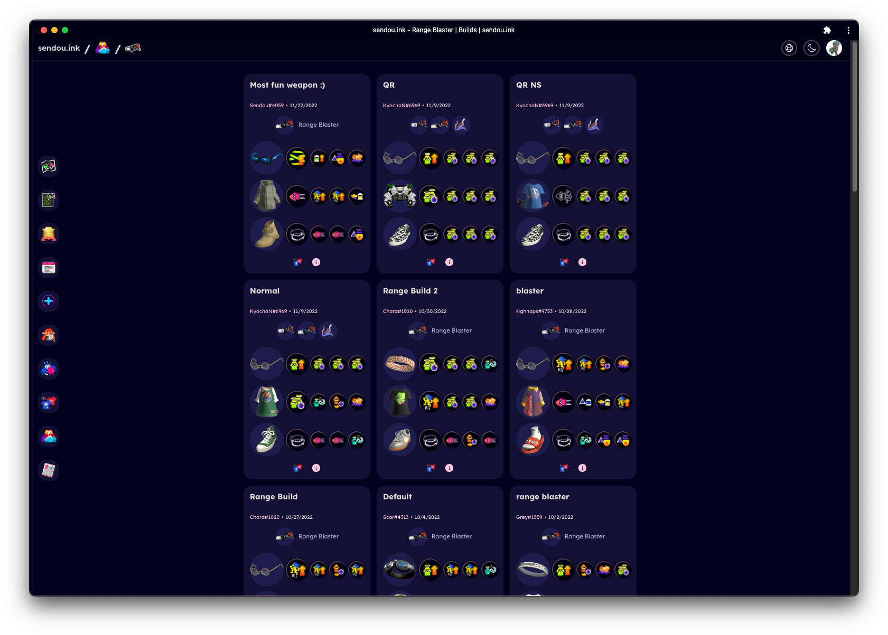
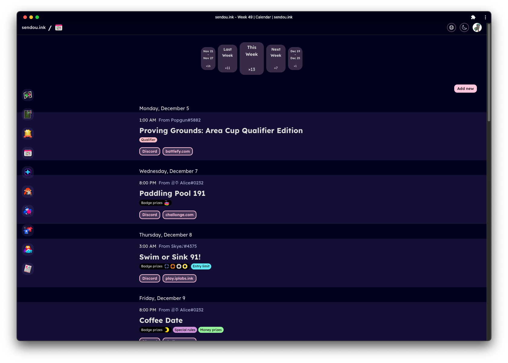
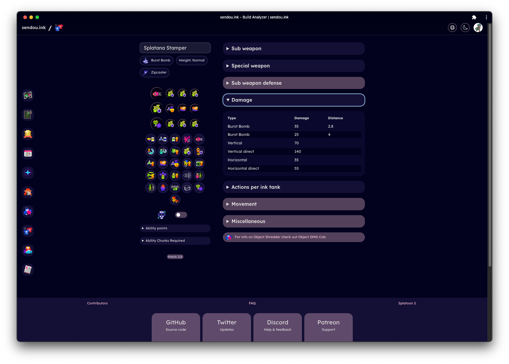

<center></center>
<center><a href="https://sendou.ink" target="_blank" rel="noreferrer">sendou.ink</a></center>
<center></center>

Competitive Splatoon Hub with over 20k registered users.

## Selected Features

- Map planner that lets you draw on maps and insert weapons
- Map list generation tool
- Win badges from tournaments, management tools for TO's
- Calendar to find out upcoming events to play in
- Event result reporting
- Plus Server for top player "looking for group purposes" voting and suggestion tools.
- User pages
- User search
- Object Damage Calculator (how much does each weapon deal vs. different objects)
- Build Analyzer (exact stats of your builds)
- Auth via Discord
- Light and dark mode
- Localization

## Tech stack

- React
- Remix
- Sqlite3
- CSS (plain)

## Screenshots





---

## Running locally

### sendou.ink

Prerequisites: [nvm](https://github.com/nvm-sh/nvm)

There is a sequence of commands you need to run:

1. `nvm use` to switch to the correct Node version. If you don't have the correct Node.js version yet it will prompt you to install it via the `nvm install` command. If you have problems with nvm you can also install the latest LTS version of Node.js from [their website](https://nodejs.org/en/).
2. `npm i` to install the dependencies.
3. Make a copy of `.env.example` that's called `.env`. Filling additional values is not necessary unless you want to use real Discord auth or develop Lohi bot.
4. `npm run migrate up` to set up the database tables.
5. `npm run dev` to run the project in development mode.
6. Navigate to `http://localhost:5800/admin`. There press the seed button to fill the DB with test data. You can also impersonate any user (Sendou#0043 = admin).

## Contributing

See [CONTRIBUTING.md](./CONTRIBUTING.md) for more information.

### Translations

[Translation Progress](https://github.com/Sendouc/sendou.ink/issues/1104)

sendou.ink can be translated to any language. All the translations can be found in the [locales folder](./public/locales). Here is how you can contribute:

1. Copy a `.json` file from `/en` folder.
2. Translate lines one by one. For example `"country": "Country",` could become `"country": "Maa",`. Keep the "key" on the left side of : unchanged.
3. Finally send the translated .json to Sendou or make a pull request if you know how.

Things to note:

- `weapons.json` and `gear.json` are auto-generated. Don't touch these.
- If some language doesn't have a folder it can be added.
- Some translated `.json` files can also have some lines in English as new lines get added to the site. Those can then be translated.
- Some lines have a dynamic part like this one: `"articleBy": "by {{author}}"` in this case `{{author}}` should appear in the translated version unchanged. So in other words don't translate the part inside `{{}}`.
- There is one more special syntax to keep in mind. When you translate this line `"project": "Sendou.ink is a project by <2>Sendou</2> with help from contributors:",` the `<2></2>` should appear in the translated version. The text inside these tags can change.
- To update a translation file copy the existing file, do any modifications needed and send the updated one.

Any questions please ask Sendou!

### Articles

1. Take an existing article as base: https://raw.githubusercontent.com/Sendouc/sendou.ink/rewrite/content/articles/in-the-zone-26-winners.md
2. Copy and paste the contents to a text file
3. First edit the info section at the top:

- "title" = title of the page
- "date" = date when this article was written (format YYYY-MM-DD)
- "author" = your name as you want it shown on the website

4. Write the actual article below the second `---`
5. You can use Markdown for more advanced formatting (read https://docs.github.com/en/get-started/writing-on-github/getting-started-with-writing-and-formatting-on-github/basic-writing-and-formatting-syntax for more info)
6. Name the file as you want the url to be. For example `in-the-zone-26-winners.md` becomes `https://sendou.ink/a/in-the-zone-26-winners`
7. Send the file to Sendou (or open a pull request if you know how)
8. Optional: also send an image as .png if you want to show a link preview. Preferred dimensions are 1200 × 630.

## API

If you want to use the API then please leave an issue explaing your use case. By default I want to allow open use of the data on the site. It's just not recommended to use the same API's the web pages use as they are not stable at all and can change at any time without warning.

## Project structure

```
sendou.ink/
├── app/
│   ├── components/ -- React components
│   ├── db/ -- Database layer
│   ├── hooks/ -- React hooks
│   ├── modules/ -- "nodu_modules but part of the app" https://twitter.com/ryanflorence/status/1535103735952658432
│   ├── routes/ -- Routes see: https://remix.run/docs/en/v1/guides/routing
│   ├── styles/ -- All .css files of the project for styling
│   ├── utils/ -- Random helper functions used in many places
│   └── permissions.ts / -- What actions are allowed. Separated by frontend and backend as frontend has constraints based on what user sees.
├── discord-bot/ -- Lohi Discord bot that works together with sendou.ink
├── migrations/ -- Database migrations
├── public/ -- Images, built assets etc. static files to be served as is
└── scripts/ -- Stand-alone scripts to be run outside of the app
```

NOTE: `public/static-assets` should only have files that don't change as it is cached for 1 month.

### Feature folders

Feature folders contain all the code needed to make that feature happen. Some common folders include:

- routes (same principle as Remix file system routing)
- queries
- components
- core (all core logic, separated from any React details)

Some common files:

- styles.css
- feature-hooks.ts
- feature-utils.ts
- feature-constants.ts
- feature-schemas.server.ts

Note: for anything that should be accessed outside of that feature should be re-exported in the index.ts file (information hiding).
Note2: Currently the project is in progress to migrating this style so that's why not everything is using it yet.

## Commands

### Converting gifs (badges) to thumbnail (.png)

```bash
sips -s format png ./sundae.gif --out .
```

### Add new badge to the database

```bash
npm run add-badge -- sundae "4v4 Sundaes"
```

### Rename display name of a badge

```bash
npm run rename-badge -- sundae "New 4v4 Sundaes"
```

### Convert many .png files to .avif

While in the folder with the images:

```bash
for i in *.png; do npx @squoosh/cli --avif '{"cqLevel":33,"cqAlphaLevel":-1,"denoiseLevel":0,"tileColsLog2":0,"tileRowsLog2":0,"speed":6,"subsample":1,"chromaDeltaQ":false,"sharpness":0,"tune":0}' $i; done
```

## How to...

### Download production database from Render.com

Note: This is only useful if you have access to a production running on Render.com

1. Access "Shell" tab
2. `cd /var/data`
3. `cp db.sqlite3 db-copy.sqlite3`
4. `wormhole send db-copy.sqlite3`
5. On the receiver computer use the command shown.

### Doing monthly update

1. Fill /scripts/dicts with new data from leanny repository:
   - weapon = contents of `weapon` folder
   - langs = contents of `language` folder
   - Couple other at the root: `GearInfoClothes.json`, `GearInfoHead.json`, `GearInfoShoes.json`, `spl__DamageRateInfoConfig.pp__CombinationDataTableData.json`, `SplPlayer.game__GameParameterTable.json`, `WeaponInfoMain.json`, `WeaponInfoSpecial.json` and `WeaponInfoSub.json`
2. Update `AVAILABLE_SR_GEAR` with new SR gear
3. Update all `CURRENT_SEASON` constants
4. Update `CURRENT_PATH` constants
5. `npm run create-misc-json`
6. `npm run create-gear-json`
7. `npm run create-analyzer-json`
8. `npm run create-object-dmg-json`
9. Fill new weapon ID's by category to `weapon-ids.ts` (easy to take from the diff of english weapons.json)
10. Get gear id's for each slot from /output folder and also update gear id files.
11. Replace `object-dmg.json` with the `object-dmg.json` in /output folder
12. Replace `weapon-params.json` with the `params.json` in /output folder
13. Delete all images inside `main-weapons`, `main-weapons-outlined` and `gear` folders.
14. Replace with images from Lean's repository.
15. Run the `npm run replace-img-names` command
16. Run the `npm run replace-weapon-names` command
17. Run the avif generating command in each image folder.
18. Update manually any languages that use English `gear.json` and `weapons.json` files

### Fix errors from the CI Pipeline

If you change any files and the CI pipeline errors out on certain formatting/linting steps (e.g. the `Prettier` or `Stylelint` step), run this command in the repo's root directory:

```sh
npm run cf
```

Before committing, if for some reason you see an abnormally high amount of files changed, simply run `git add --renormalize .` and it will fix the error.

- Background info: this is caused by the line endings on your local repo not matching those with the remote repo's, which should remove the vast majority of unstaged files that appears to have no changes at all.
- Reference: https://docs.github.com/en/get-started/getting-started-with-git/configuring-git-to-handle-line-endings
