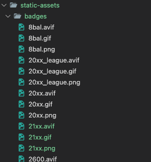
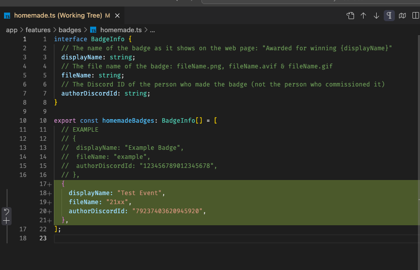

# Badge guide

## What are badges?

Badges are a virtual prize that users can win from tournaments and then display on their profile.

Current list of them can be seen here https://sendou.ink/badges

## Rules

Any badge to be added has to follow these rules. Badges that do not follow the rules will not be added to the site or can be removed at any time:

**Quality and consistency** has to be matching those already on the site.

**Uniqueness** i.e. the added badge has to be different enough from those already on the site.

**Variations** for a maximum of 3 per unique design (e.g. 1st, 2nd & 3rd place variations). For further additions it has be a completely different and unique design and not just recolor or small design changes.

**No AI** every badge has to be made by a human.

**Made for sendou.ink/approved usage** badges have to be commissioned for this exact purpose or otherwise agreed with the person who made them so that they fully understand what they are used for.

**As tournament prizes** the badge are meant to be given out as tournament prizes (awarded for reaching certain placement). If you have any other idea in mind then you need to check that with Sendou separately.

## Adding a new badge

1. First badge needs to be made
- 3D artists can use [picoCAD](https://johanpeitz.itch.io/picocad)
- Some quick guide to picoCAD can be found pinned in the #badges Discord channel
- Others can use the "[badges" Discord channel](https://discord.gg/sendou) to inquire about a commission
- Read rules from above carefully at this point and ask if you do not understand something
2. Create needed files
- .gif file (animated), black solid background. Create via [picoCAD Web Viewer](https://lucatronica.github.io/picocad-web-viewer/)
- .png file (static). TODO: info on how to ceate
- .avif file (static). Create via e.g. [Squoosh](https://squoosh.app/) from the .png file
- All files should be squares. 512x512 is a good size for example
- For the animation, rotating speed should match those of the borzoic badges. You can control this via left & right arrow keys on picoCAD Web Viewer.
3. Make a pull request to the project
- If you don't know how a pull request is made you can ask someone you know that is familiar with GitHub or refer to the guide pinned in the #badges Discord channel
- In the PR add the 3 needed files to public/static-assets/badges folder:

- Also update app/features/badges/homemade.ts file (read the comments to understand each value)
- Note the file name should not contain spaces or big letters:

❌ paddling pool.gif  
❌ PaddlingPool.gif  
✅ paddling-pool.gif

4. Wait for Sendou to look into the pull request
- Sometimes this can take a while if Sendou is busy
- Changes might be requested

5. Wait for the site to be updated
- After the pull request is merged it does not automatically go to the site yet
- Normally the site updates a couple times a week, but this can vary

6. Request permissions
- After you see your badge on the /badges page you can request manager permissions to it on from the staff on the helpdesk channel

7. Give out the badges to tournament winners
- Badge can be given out via the /badges page

## Updating a badge

Make a new pull request making the changes you need. The `fileName` should always remain the same.
