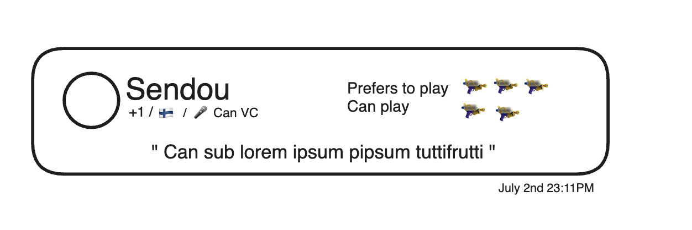

## TournamentSub

userId
tournamentId
message // optional
canVc
bestWeapons // 23,240,44 - mandatory
okWeapons // 23,240,44 - optional
visibility (+1/+2/+3/Top 500/ALL)
createdAt

to.id.subs

- Button to add itself as sub (only if not in team)
  - Handle not checked in teams containing ghost members
- Automatically remove from list if joining a tournament team
- Choose up to 5 weapons that prefer to play and 5 that can play if needed
- Choose visibility and filter visibility
- Filter by weapon
- Tab that visible while tournament is happening but hidden after tournament is finalized
- best weapons / ok weapons can't share weapons
- Sort subs so that +1 is highest then +2 etc. tiebreaker = createdAt
- Before registering team show "No team? Register as a sub" text with link

